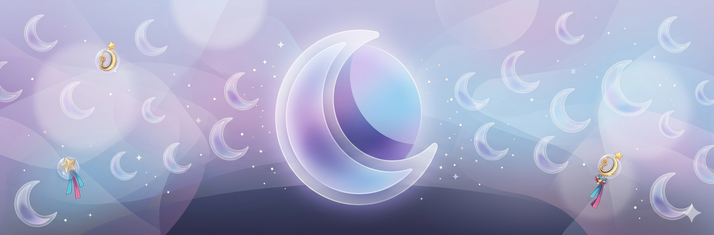

# 🌌 ASTERIA & LUNA Chat AI

  

**Asteria** es un entorno web diseñado como un espacio seguro y de apoyo emocional. Su componente principal es **LUNA**, una inteligencia artificial conversacional empática y cálida.

El proyecto busca ofrecer una interfaz estéticamente relajante, combinando tonos pastel, efectos de cristal (glassmorphism) y herramientas de bienestar diario.

---

## ✨ Características Principales

### - 🌙 **Chat con LUNA**
- Un chatbot integrado (vía API) diseñado para escuchar y brindar apoyo emocional.
### - 🧘 **Interfaz de Paz (Asteria)**
-  Diseño web moderno y fluido con `backdrop-filter` para un efecto de cristal inmersivo.
### - 🧠 **Memoria Local**
-  Uso de `localStorage` para recordar el nombre o apodo preferido del usuario sin comprometer su privacidad pues no requiere base de datos externa.
### -  - 📜 **Inspiración Diaria**
-  Integración con API de frases motivacionales dinámicas al iniciar la plataforma.
### - 🔒 **Privacidad First**
- Todo el procesamiento del entorno se maneja de forma segura y anónima.

---

## 🛠️ Tecnologías Utilizadas

- **Frontend:** HTML5, CSS3 (Vanilla).
- **Lógica:** JavaScript (ES6+).
- **Tipografía:** [Plus Jakarta Sans](https://fonts.google.com/specimen/Plus+Jakarta+Sans) (Google Fonts).

---
